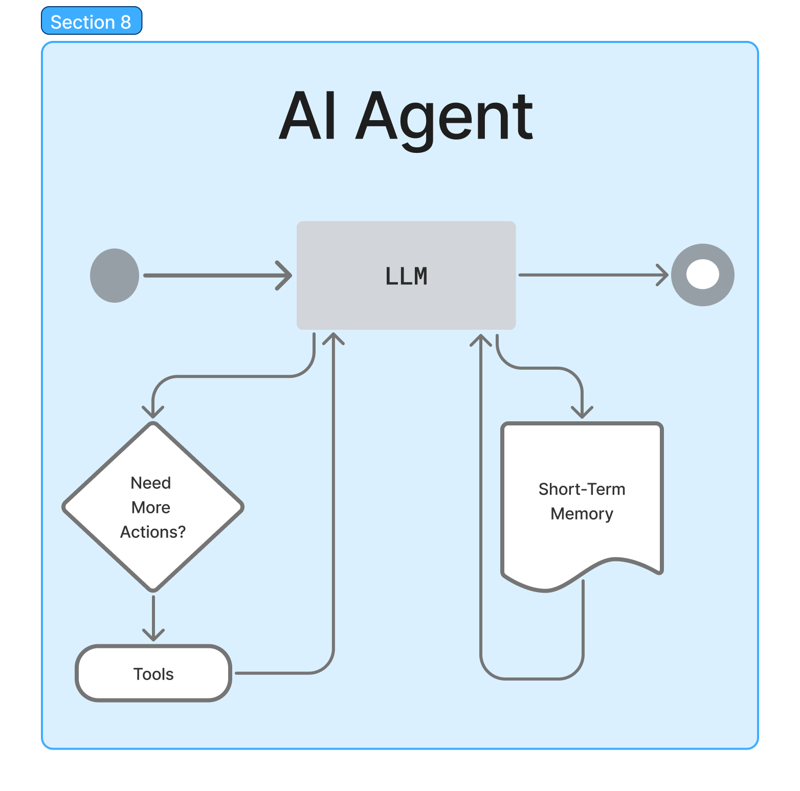
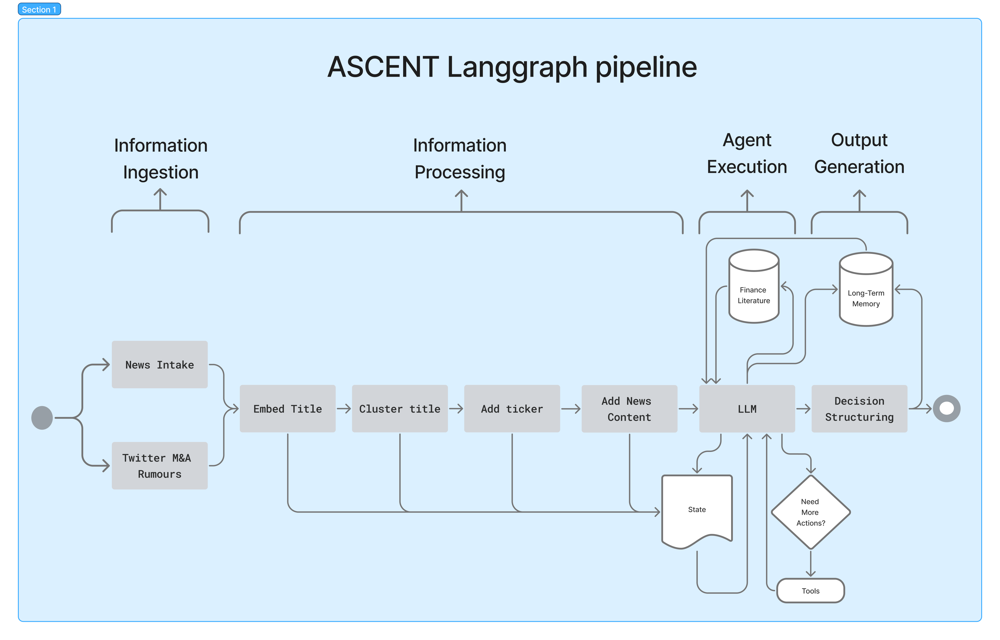
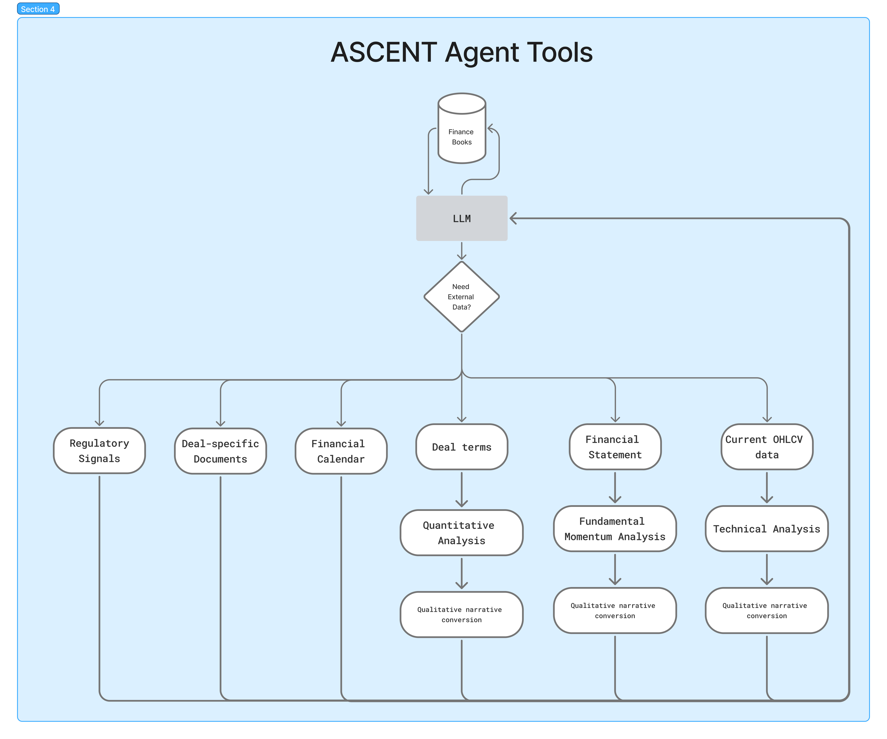
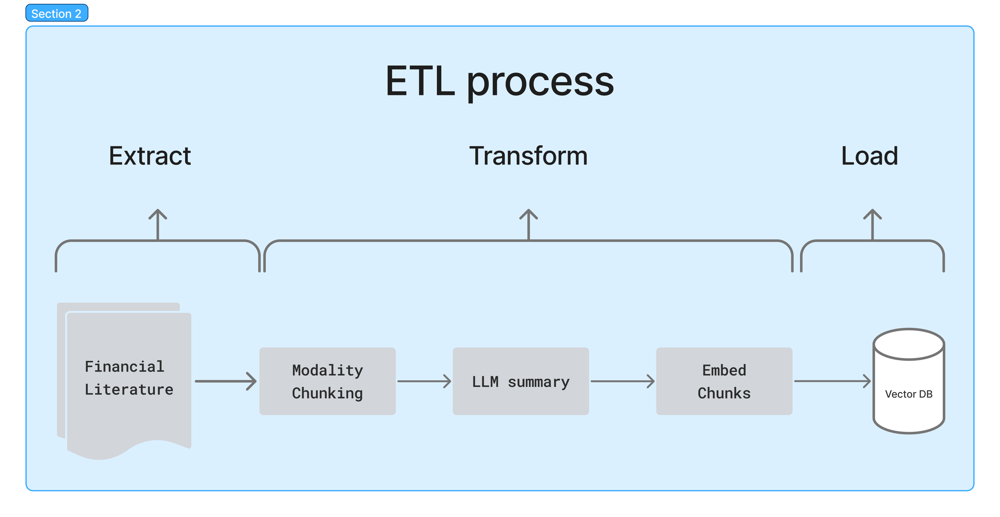
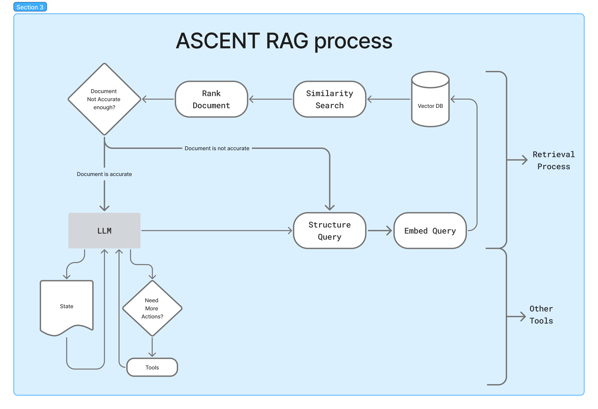
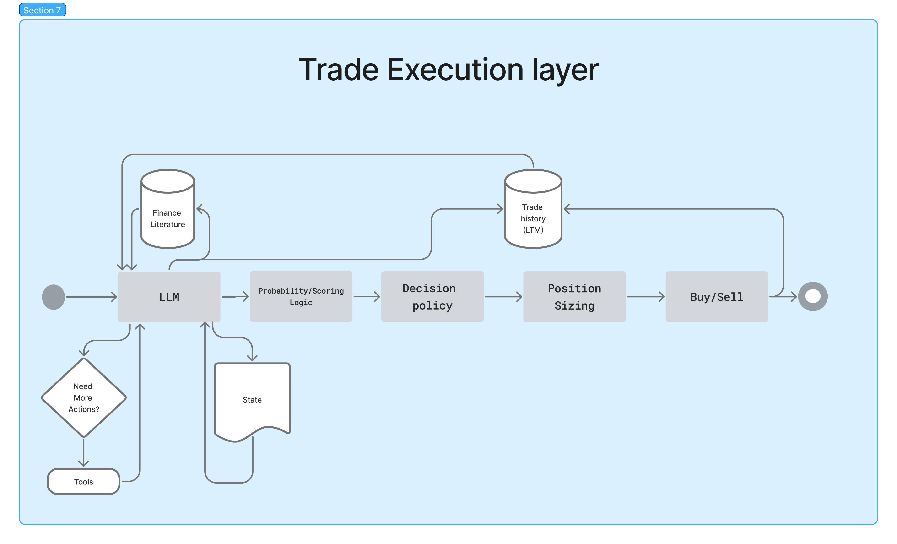

# ASCENT(Agentic System for Contextual Event-driven NarraTive insights)
*This is a project created by Cornell Sidharta/corn-ghwp, exploring a potential architecture for Event-driven AI trading agent. This architecture lets AI agent automatically and autonomously processes financial news, market events, and other market data(can either be qualitative or quantitative) to generate actionable insights.*
## Event-Driven Strategy
Event-driven strategy is an investment strategy to seek gains from temporary stock mispricing, caused by corporate events such as mergers, acquisitions, bankruptcy, spinoffs, etc [^Kenton_2025]. This strategy is difficult due to information fragmentation, each acting as noisy signals. Then these noises still need to be interpreted through the contextual reasoning of experts. In addition, much of this process remains manual, where participants need to continuously monitor news, and synthesize insights.

[^Kenton_2025]: Kenton, Will. “Exploit Market Opportunities With Event-Driven Investing Strategies.” Investopedia. Updated October 21, 2025. https://www.investopedia.com/terms/e/eventdriven.asp.

To ground this discussion, merger arbitrage is chosen as a representative proving ground. Interpreting insights from an merger arbitrage includes multiple steps. According to Klymochko[^Klymochko_2025], it typically starts with sourcing all merger investment opportunities, then compiling these data along as its term to analyze the agreement. Then for each deal, calculate the potential return, known as the spread, and its downside if the deal fails. Lastly, estimate the probability of success, then compute its expected return and risk to see if the deal is worth executing. Each step in analyzing an event are taken from a combination of structured data(e.g. Deal terms, market data, company fundamentals, etc.) and unstructured data(e.g. legal documents, social media signals, news, etc.). In addition, each should be analyzed for qualitative reasoning (e.g. strategic rationale, timing dynamics, deal dynamics, etc.) or quantitative analysis(e.g. Deal close probability, spread, expected return, etc.). All these factors needs to be taken into account before making a decision.

[^Klymochko_2025]: Klymochko, Julian. A Practitioner’s Guide to Merger Arbitrage. Accelerate Shares, n.d.

## Current Approaches
Approaches in getting insights for merger arbitrage generally rely on quantitative techniques such stochastic processes[^Khan_2017], Neural Networks[^Karatas_Hirsa_2025], Random Forest[^Wang_Ahmed_2023], or other Machine Learning techniques[^Reinhardt_2024]. These methods identify patterns well, then provides structured quantitative probabilitic outputs, but are generally blind on unstructured datas. Qualitative methods such as using an Large Language Model(LLM) can also be used. LLM can provide better insights for unstructured data, but has limitations such as Hallucinations and knowledge cutoffs. Neither approaches alone provides complete solution. A hybrid system—integrating quantitative methods with  real-time, evidence-grounded language models—is necessary to produce actionable insights.

[^Khan_2017]: Khan, Zaahid Ahmed. "Modeling Merger Arbitrage Situations Using Stochastic Processes." Senior thesis, Harvard University, (2017). http://nrs.harvard.edu/urn-3:HUL.InstRepos:38811497.

[^Karatas_Hirsa_2025]: Karatas, Tugce, and Ali Hirsa. "Predicting Status of Pre- and Post-M&A Deals Using Machine Learning and Deep Learning Techniques." Digital Finance 7, no. 1 (2025): 106 pages. https://doi.org/10.1007/s42521-024-00120-5.

[^Wang_Ahmed_2023]: Wang, Minghao, and Abdullah Ahmed. "M&A Success Prediction and Performance of Risk Arbitrage." Master's thesis, Copenhagen Business School, (2023). https://example.cbs.dk/handle/xxxx.

[^Reinhardt_2024]: Reinhardt, Philipp Marius. "A Comparative Study of Machine Learning Methods for Merger Arbitrage." Master's thesis, Johann Wolfgang Goethe-Universität, (2024). https://nbn-resolving.org/urn:nbn:de:hebis:30:3-874360.

## Proposed solution
We present ASCENT(Agentic System for Contextual Event-driven NarraTive insights), a modular pipeline to detect and handle event trigger, while combining existing approaches, into insights, through a tool and retrieval based LLM agent. Trigger such as merger news can be passed into an LLM agent. This agent as its base reasons base on knowledge base, which contains literature information from M&A books, documents etc. It can also reiteravely call "tools", which is action that can be taken by the agent. These action can incude running broad quantitative methods, such as running stochastic processes, identifying financial metrics, etc., as well as getting external data such as financial calendar, company's reports, etc. In conclusion, this agent not only reasons, but also grounds his reasoning through various methods to produce implementable outputs.

Currently, ASCENT can only generates Qualitative insights. However, It can be extended into an autonomous event-driven trading bot. This can be done by transforming these insights into an execution logic pipeline such as figuring out merger completion probability, then position sizing, etc. Details are available at [Future Works](#future-works).

## Foundational Concepts
### Agent
AI agents are systems utilizing AI to reason and act, in order to autonomously complete a goal[^GoogleCloud_2026] . The most famous framework for developing an AI Agent is the ReAct framework[^Yao_2023] . Agents using the ReAct framework has ability to think and plan after each action taken. This happens continuously in a loop known as the "Think-Act-Observe" loop[^Gutowska_2026]. For example, consider a goal *"What is the square root of 321,489"*, an agent might think manually doing it is error prone, so it acts by calling the calculator tool. After taking an action, the agent will then observe the tool's result, and rethinks whether to continue looping or finalizes the result.

  
   
  <em>Figure 1: AI Agent</em>

An agent is essentially composed from 3 components, Model, Tools, and Memory[^LangChain_2026]. The model as its core is just an LLM that provides the ability to reason and act. Tools are external capabilities or resources the LLM can use perform complex task. Finally, an agent can have memory ranging from short term to long term, each for storing different types of information an agent can use for context. Fundamentally, an agent is just an autonomous LLM that uses tools and memory.

[^GoogleCloud_2026]: Google Cloud. "What Is an AI Agent?" Last updated April 2, 2026. Accessed April 19, 2026. https://cloud.google.com/discover/what-are-ai-agents.

[^Yao_2023]: Yao, Shunyu, Jeffrey Zhao, Dian Yu, Nan Du, Izhak Shafran, Karthik Narasimhan, and Yuan Cao. "ReAct: Synergizing Reasoning and Acting in Language Models." In Proceedings of the Eleventh International Conference on Learning Representations. OpenReview.net, 2023. https://arxiv.org/abs/2210.03629.

[^Gutowska_2026]: Gutowska, Anna. "What Are AI Agents?" IBM. Last modified 2026. https://www.ibm.com/think/topics/ai-agents.

[^LangChain_2026]: LangChain. "Core Components: Agents." Accessed April 19, 2026. https://docs.langchain.com/oss/python/langchain/agents.

### Retrieval-Augmented Generation (RAG)
LLM does not have access to sensitive documents or current information. Retrieval-Augmented Generation (RAG) solves this by combining LLM prompts with relevant information chunks retrieved from an external knowledge base[^Lewis_RAG_2020]. In RAG, relevant query is used to search, match and retrieve over a knowledge base, whhich istypically implemented as vector database. The results will later be used to grounds the model's reasoning in order to reduce its hallucinations, and enables access to private or domain-specific knowledge.

There are 2 main types of RAG. RAG as a pipeline vs RAG as a tool. If RAG is implemented as a pipeline, it is fixed and has a deterministic sequence of RAG operations that always run before the LLM processes. However, if RAG Is implemented as a tool, the RAG process becomes a callable function that an LLM can invoke dynamically based on its reasoning, making it more dynamic and iterative. 

[^Lewis_RAG_2020]: Lewis, Patrick, Ethan Perez, Aleksandra Piktus, Fabio Petroni, Vladimir Karpukhin, Naman Goyal, Heinrich Küttler, et al. "Retrieval-Augmented Generation for Knowledge-Intensive NLP Tasks." In Advances in Neural Information Processing Systems 33, 9459–9474. Curran Associates, 2020. https://arxiv.org/abs/2005.11401.

### Langgraph
To create this agent, langgraph is used. Langgraph is a specialized library built on top of Langchain. It is a multi-agent LLM orchestration framework, designed to build a stateful agentic pipeline[^LangGraph_2026]. Pipelines are built using StateGraph, which is the backbone that organizes three main langgraph components, State, Nodes, and Edges[^LangGraph_GraphAPI_2026] .

State acts as a centralized data structure, that is passed sequentially to all the components in the pipeline. State behaves like a structured temporary memory, or a "snapshot" of the current pipeline, where each component can read and update it.  In addition, how states are updated can be controlled through reducer function. State can be used to pass data between components, accumulate each components result, adding persistence, storing conversation history, etc. In essence, state enables communications between components.

Nodes represent processes in the pipeline. Each node executes a single pipeline step. Node takes the current state, perform operations, and updates the state. The primary use for a node is to query an agent, followed by tool execution. However, node can also be used for data retrieval, data processing, data validation, error handling, etc. As its core, node is simply just a function.

Edges define the execution order of nodes, controlling the order and flow of the pipeline. A pipeline contains at least one "Start" edge and "End" edge, which defines which node runs first, and which node terminates the pipeline consequently. In between, Each edge is defined between two nodes, which tells which node runs after the current node completes. On top of that, there is a special "conditional" edge that chooses which node to run next based on the current state. Together, these edges transform a set of isolated nodes into a continuous workflow.

[^LangGraph_2026]: LangGraph. "Thinking in LangGraph." Accessed April 19, 2026. https://docs.langchain.com/oss/python/langgraph/thinking-in-langgraph.

[^LangGraph_GraphAPI_2026]: LangChain. "Graph API Overview." Accessed April 19, 2026. https://docs.langchain.com/oss/python/langgraph/graph-api.

### Langgraph ReAct agent
Langgraph provides a convenient way to build an AI agent using the *create_react_agent* API[^LangGraph_create_react_agent_2026] . This API builds an agent graph, which is simply just a collection of nodes. An agent graph can be build by passing at least an LLM model[^LangChain_Models_2026], and a list of tool/s[^LangChain_Tools_2026] . In addition, short term memory(state) can also be passed using a checkpointer[^LangChain_ShortTermMemory_2026]. To implement this API, Langgraph provides various methods to pass in the LLM model, but commonly, a direct provider package, such as *"langchain_openai"* or *"langchain_anthropic"* is used. Meanwhile, for the list of tool/s, each is just a callable function with the *"@tool"* decorator and a custom description, where each function needs to return either a string, object, or a special Command object[^LangGraph_Command_2026].This API will internally collect them into a single TooLNode, which is a prebuilt langgraph node that execute tools. Setting up these two is generally enough to build a ReAct agent.

[^LangGraph_create_react_agent_2026]: LangChain. "create_react_agent." In LangGraph Reference. Accessed April 19, 2026. https://reference.langchain.com/python/langgraph/prebuilt/langgraph.prebuilt.chat_agent_executor.create_react_agent/.

[^LangChain_Models_2026]: LangChain. "Models." Accessed April 19, 2026. https://docs.langchain.com/oss/python/langchain/models.

[^LangChain_Tools_2026]: LangChain. "Tools." Accessed April 19, 2026. https://docs.langchain.com/oss/python/langchain/tools#toolnode.

[^LangChain_ShortTermMemory_2026]: LangChain. "Short-Term Memory." Accessed April 19, 2026. https://docs.langchain.com/oss/python/langchain/short-term-memory.

[^LangGraph_Command_2026]: LangChain. "Command Class." In LangGraph Reference. Accessed April 19, 2026. https://reference.langchain.com/javascript/langgraph/classes/langgraph_command.Command.html

## System Design
### Pipeline Overview

  
   
  <em>Figure 2: ASCENT LangGraph pipeline.</em>

ASCENT is an event-driven agentic pipeline that generates structured insight by combining multi-source information ingestion and processing, LLM reasoning, tool-based computation and retrieval-augmented grounding. Figure 2 depicts this process using the follwing notation: Filled squares denote LangGraph nodes, white square denote tools, cylinders represent lon-term data storage, document icons represent temporary data storage , and finally arrows represent a LangGraph edges.

The state acts as a shared temporary data storage that is available across the pipeline's session, including all preprocessing and agentic nodes. It acts as a medium for passing data between pipeline stages, or a storage for an agent to read and write  into.  Throughout the pipeline, the state is used anywhere from storing news and ticker clusters, holding intermediate calculations, preserving conversation history, and also storing the final insight. In summary, the state manages the pipeline's data for the entire session.

This pipeline starts by querying external events from multiple sources, where each source must contain a title. Each title is then embedded, and clustered with respect to their their embedding similarity, in order to group semantically related events. Clusters are then assigned with a ticker, which can either be extracted directly from the source, or resolved through a two-step technique using Name Entity Recognition(NER), followed by fuzzy mapping over a ticker reference list[^Manning_IR_2008]. Finally, The result is stored in the state, which is then accessed by the agent.

The Agentic stage consists of three main components, an LLM, a knowledge retrieval system (RAG), and a suite of tools for additional capabilities. For every event group, the LLM retrieves the appropriate knowledge per ticker through a [Retrieval process](#rag-retrieval-process). This guides the agent's next action, selecting the next action from a range of tools. This process happens in a loop until an agent can reach a conclusion. Finally, the conclusion is stored in the state, and also processed through an output layer before being stored in the long term memory.

Occasionally, the agent also needs to figure out if a ticker has been analyzed in a current session, which can be done by traversing the output generated in the state so far. It will then treat these prior output as additional knowledge base, guiding the agent to generate a new insight on top. In the end, an agent outputs a list of ticker, each ticker containing a list of sequenced insight, where each sequence corresponds to a different event being processed.

[^Manning_IR_2008]: Manning, C. D., Raghavan, P., & Schütze, H. (2008). *Introduction to Information Retrieval*. Cambridge University Press. Chapter 13: Approximate String Matching. Available at: https://nlp.stanford.edu/IR-book/
### Implementation details

#### Tool Calling
Tools are basically callable functions to extend an agent's capability. Once a tool is provided, an agent can call it autonomously, eliminating the need for complicated manual configuration. In ASCENT, tools are integrated with an agent to gather near real-time external resources, perform quantitative calculation, conduct qualitative reasoning on relevant sources, review past outputs, or perform any additional operations as needed. An example of the tools used is outline if Figure 3, where each tools are specifically tailored for the a merger arbitrage case. These tools are divided into two main use case, executing relevant operations and retrieving additional information.

  
   
  <em>Figure 3: ASCENT Agent tools</em>

An agent can use a tool to execute additional relevant operations, usually to perform an analysis using various different methods. Each tool can apply the appropriate analytical method (e.g., quantitative metrics, fundamental analysis, or technical analysis) depending on the input type. In the case where quanitative results are obtained, the resulting output is structured, and passed to a qualitative narration conversion layer, where numerical signals are paired up with a natural language description, allowing the agent to reason over abstracted concepts rather than numerical values. Overall, these additional operations enable a hybrid approach that can leverage the strengths of past analytical techniques.

Additionally, an agent can also use tools to either fetch internal or external knowledge base. For instance, when more knowledge about an event is needed, an agent might use a tool to obtain external data using thrid-party API integration, or fetch additional internal knowledge via the [Retrieval process](#future-works).  For a merger arbitrage, additional information can include knowledge such as regulatory signals(antitrust cases, govenment announcements, legal fillings), deal-specific documents(proxy statements, merger agreements, press releases), financial calendars, and more. Together with other tools that executes quantitative and qualitative operations, the agent can turn event signals into actionable insights as best as possible.

Tools are versatile since they can provide structured insights, regardless of the underlying data source or analytical method. Its modularity makes it extensible to additional methods that can be implemented in the future, without modifying the core agent's reasoning logic, enabling the agent to access additional information and transform it into actionable insights rather than just relying on its own training. This is strongly represented by the RAG process, which is described in the following section.

#### RAG 
In ASCENT, tool-based Retrieval Augmented Generation(RAG) process is used, as opposed to the usual pipeline based. This allows the agent to invoke it dynamically when more context is required, essentially answering *"what to do, given situation X"*. This process anchors the agent reasoning towards a knowledge base, where it improves its accuracy and reduces hallucinations. However, before the RAG process can operate, a process known as the Extract Transform Load(ETL) process is needed to build this knowledge base and store it into the vector database.

##### ETL process

  
   
  <em>Figure 4: ASCENT ETL process.</em>

The ETL process is responsible for preparing knowledge before storing it for RAG retrieval. Figure 4 shows the ETL process done in ASCENT. Firstly, the extract phase collects different kinds of financial literature documents, such as Mergers&Acquisition academic literature or books. Secondly, these documents are segmented into smaller chunks in the transform process, where each chunk will be summarized by an LLM that follows a given template:*"what to do, given situation X"*. Each summary are then embedded and stored into a vector database. Embedded summaries are then matched in the RAG process to fetch the relevant doument. In short, this ETL process ensures each knowledge is structured and optimized for retrieval. By applying chunking and LLM summarization, the retrieval process can later more accurately map an event to a desired action.

##### RAG retrieval process

  
   
  <em>Figure 5: ASCENT RAG process.</em>

The RAG process is outline in Figure 5. It begins with the LLM generating a query, structured to match the content embedded in the ETL process. In this particular process, the query outlines the type of situation an event is currently in, where each query is embedded and matched with the embedded contents inside the vector database. This metching process uses a similarity search metric, such as cosine similarity, to retrieve a group of document chunks.

Retrieved document is then ranked and filtered by relevance using an appropriate heuristic. The top documents retrieved are then evaluated further by the LLM to check whether the retrieved context is sufficient. This sufficiency can be determined, for example, via a simple LLM prompt to validate if an agent has enough information on how to decide the next action. If the LLM determines that the context is not enough, the LLM will restructure the query and do the retrieval process again. However, once a satisfactory context is retrieved, the agent is going to proceed to the next action, which may involve calling tools or finalizing the decision.

Regarding the chunking method, since most document contains text and tables, modality chunking is used here. This chunking method splits the documents by preservind its structure and integrity of each data type(text, tables, lists, images, etc.)[^Pinecone_Chunking_2026]. It works by firstly parsing the document into a structured representation, which also identifies each modality. Then each document is split, while preserving its metadata. For large document, overlapping boundaries between each split is maintained, in order to preserve context accross splits. In conclusion, this kind of chunking strategy is well-suited for the types of document used.

 In an event driven system, where decisions are high stake, This RAG process ensures agent grounds its reasoning by evidence from the knowledege base. It enables agent acts methodically through informed context, preventing hallucinations or unconditioned action. In conclusion, this RAG process is an integral part of ASCENT in generating more accurate and actionable insight.

[^Pinecone_Chunking_2026]: Pinecone. “Chunking Strategies for LLMs & Vector Search.” *Pinecone Learn*. Accessed April 2026. https://www.pinecone.io/learn/chunking-strategies/

## Limitation
The pipeline implemented here is imperfect. There are multiple cases where an improvement can be made, particularly on architecture design, which includes reliance on temporary state and also error propagation. Firstly, the system primarly relies on state for storing the current session data. Although this is easier to implement, data can be lost during cutoff. In addition, mistakes in early stages, such as in incorrect NER extraction, fuzzy mapping errors, misclustered event groups, can propagate downstream in the system, producing inaccurate insights. Therefore, implementing additional features such as additional validation node could help mitigte these effect.

Another limitation is the preprocessing latency. Each event passes through multiple steps, such as information pre-processing, RAG retrieval, tool execution, and LLM reasoning. These stages can introduce noticable delays particularly when processing high volume of news simultneously. In short, this latency can hinder the generation of insights.

## Future Works
### Execution layer extension(Autonomous trading bot)

  
   
  <em>Figure 6: Trade execution layer.</em>

The introduction of an execution layer enables the pipeline to turn from a merely insight generator into an autonomous trading bot, a system which automatically determines and exectues an order with limited or no human intervention[^ESMA_Definitions_2026]. This layer needs to be able to translate the agent's final decisions into executable trading actions. 

Figure 6 depicts an example pipeline for an autonomous event driven trading bot. Once an agent finishes generating insights, these need to be translated into a probability/scoring logic. There are multiple approaches for this, and figuring out which method is optimal still remains a challenge. These scores can later be appplied into a decision policy to determine whether to open position. If the scores satisfy the policy, the the position sizing logic calculates the appropriate allocation for the position, and the position can then be opened using 3rd party trading API such as MetaTrader[^MetaTrader_Platform].

This Autonomous event driven trading bot can operate daily before the market opens, or even continuously to mmonitor incoming events. This can be achieved by hosting the pipeline on cloud services that supports scheduled tasks. For example, this pipeline can be containerized using docker[^Docker_Website], then deployed into Amazon AWS ECS Fargate[^AWS_ECS_Docs][^AWS_Fargate_Docs]. For scheduled execution, Amazon's EventBridge service[^AWS_EventBridge_Docs] can be used to trigger the container on a predefined intervals, such as before market opens. In summary, this pipeline can be run periodically to autonomously monitor and manage positions.

Closing the position can be done the moment where a deal settles, which requires continous tracking of current opened position. This can be done through the trade history stored in the agent's long term memory, where each position needs to be closely maintained, readjusted and pulled once the agent found relevant news. Additionally, a trailing stop loss can also be put when opening a position to manage potential breakout. Overall, position exits can be freely adjusted for an effective position management.

[^ESMA_Definitions_2026]: European Securities and Markets Authority. "Article 4 Definitions." ESMA Interactive Single Rulebook. Accessed April 21, 2026. https://www.esma.europa.eu/publications-and-data/interactive-single-rulebook/mifid-ii/article-4-definitions.
[^MetaTrader_Platform]: MetaQuotes. *MetaTrader Trading Platform Documentation*. MetaQuotes Ltd. Accessed April 2026. https://www.metatrader4.com/ or https://www.metatrader5.com/
[^Docker_Website]: Docker. *Docker — Enterprise Container Platform*. Docker, Inc. Accessed April 2026. https://www.docker.com/
[^AWS_ECS_Docs]: Amazon Web Services. *Amazon Elastic Container Service (ECS) Developer Guide*. AWS. Accessed April 2026. https://docs.aws.amazon.com/ecs/
[^AWS_Fargate_Docs]: Amazon Web Services. *AWS Fargate – Serverless Compute for Containers*. AWS. Accessed April 2026. https://docs.aws.amazon.com/fargate/
[^AWS_EventBridge_Docs]: Amazon Web Services. *Amazon EventBridge Developer Guide*. AWS. Accessed April 2026. https://docs.aws.amazon.com/eventbridge/

### Data to Backtest and tune Hyperparameters 
To backtest or tune any hyperparameters used in any of the agent's process, three datasets are required: past news information, past M&A deals with its related informtion, and also OHLCV data of the deals. There are free sources available for each. For the news dataset, three fields are required, the headline, content and date. A simple and free dataset is provided on kaggle, titled "Financial News Headlines Data."[^Pham_Lucas_2026]. Although not comprehensive, this dataset covers news spanning from early 2018 to mid-2020. Likewise, for past deals and its related information, the IMAA-Institute[^IMAA_Industries_2026]  provides a vast, free-of-charge database of M&A statistics and research after a simple, free membership registration. Lastly, ohlcv data can be found simply from Yahoo Finance[^Yahoo_OHLCV_2026].

[^Pham_Lucas_2026]: Pham, Lucas. "Financial News Headlines Data." Kaggle, 2020. Accessed April 21, 2026. https://www.kaggle.com/datasets/notlucasp/financial-news-headlines.
[^IMAA_Industries_2026]: Institute for Mergers, Acquisitions and Alliances (IMAA). "M&A Statistics by Industries." IMAA-Institute. Accessed April 21, 2026. https://imaa-institute.org/mergers-and-acquisitions-statistics/ma-statistics-by-industries/.
[^Yahoo_OHLCV_2026]: Yahoo Finance. "Historical OHLCV Data via v8/finance/chart Endpoint." Accessed April 21, 2026. https://query1.finance.yahoo.com/v8/finance/chart/AAPL?range=1y&interval=1d.

## Conclusion
ASCENT addresses the fundamental challenge in event-driven strategies, by bridging the gap between quantitative methods that performs best at pattern recognition but lacks accuracy on unstructured data, and LLMs that understand narrative context but suffer from hallucinations and knowledge cutoffs. By integrating an LLM with additional components such as tool-based retrieval (RAG), a modular LangGraph pipeline, and a knowledge base composed of financial literature, ASCENT creates an agent which generates insights that are both contextually grounded and numerically informed.